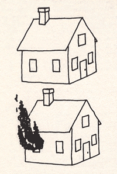

```{r setup, include=FALSE}
options(htmltools.dir.version = FALSE)
library(gridExtra)
library(dplyr)
```

class: middle, clear

## 1. Probability review

## 2. Logistics

## 3. Comparing the philosophies

---

class: middle, clear

.Large[
**Reading:**  

Sections 1.1-1.5 of Bayesian Statistical Methods

<br>

**Homework for Friday:** 

Chapter 1 problems #2, 4, 8, 10, 16
]

---

class: middle, inverse

# Probability review

---

# Main results to review

.Large[
Probability mass/density functions

Joint probability/distributions

Marginal probability/distributions

Conditional probability/distributions

Bayes’ rule

Law of total probability
]

---

# Example

.large[
A spam filter is designed by looking at commonly occurring phrases in spam. Suppose that 80% of email is spam. In 10% of the spam emails, the phrase “free money” is used, whereas this phrase is only used in 1% of non-spam emails. 

1. What is the probability an email contains the phrase “free money” and is spam? 

2. Write the event that an email contains the phrase “free money” as the union of disjoint events. 

3. What is the probability that an email contains the phrase “free money?” 

4. A new email has just arrived, which does mention “free money.” What is the probability that it is spam?
]
---

# Need more review?

.Large[
Sections 1.1-1.2 of *Bayesian Statistical Methods*

[Section 2.1](https://ebookcentral.proquest.com/lib/carleton-ebooks/reader.action?docID=1648259&ppg=32) of *Bayesian Ideas and Data Analysis*

Skim sections of your probability book

[Stat 110 lectures](https://projects.iq.harvard.edu/stat110/youtube) by Joe Blitzstein at Harvard
]

---

class: inverse, middle

# Syllabus highlights

---

# Office hours (CMC 218)

.Large[

Day | Time
---- | ----
Monday    | 2:00-3:00
Tuesday   | 2:00-3:00
Wednesday | 9:30-10:30
Friday    | 9:30-10:30
Drop in   | If my door is open
Appointments | [aloy.youcanbook.me](https://aloy.youcanbook.me)

]

---

# Homework

.Large[

- Due most Tuesdays and Fridays **by 4 p.m.**

- Unexcused late homework will not be accepted

- You may work with classmates but you must write up your own assignment

]

---

# Case studies

.Large[

- 2 case studies throughout term

- completed in pairs

- these are mini projects $\rightarrow$ formal reports

]

---

# Final grade

.Large[

Component | % of grade
--------- | :-------
Homework     | 25
Case studies | 15
Exam 1 | 20
Exam 2 | 20
Final project | 20

]

---

# Important dates

.Large[

- Exam #1: Wednesday, October 16

- Exam #2: Wednesday, November 13

- Case studies: announced in class

- Project: 

    + team assignments: November 4

    + proposal and data: November 11 by 4 p.m.

    + final report: November 25 by 4 p.m

]

---

class:middle, inverse
#  Comparing the philosophies


---
# Neuroscience background

.pull-left[
.large[

**Hemispatial neglect**

Reduced capacity to process visual info from one side of their visual space

]

<br>


.large[

**Blindsight hypothesis**

People with hemispatial neglect may be aware of stimuli that cannot be consciously recollected or identified

]

]

.pull-right[
```{r echo=FALSE}

```
]

---

# Marshall & Halligan (1988)

.pull-left[
```{r echo=FALSE}

```
]

.pull-right[
.large[

Simplified version of the study:

- Patient (P.S.) presented with two cards in random order

- Asked to identify which house she would rather live in

- $Y=$ # times P.S. chose non-burning house

]
]

.footnote[
.footnotesize[
Marshall, J. C., & Halligan, P. W. (1988). Blindsight and insight in visuo-spatial neglect. *Nature*, 336(6201), 766.
]
]

---

# Before seeing any data...

.Large[
$\theta =$ probability of choosing the non-burning house

1. What's your best guess about $\theta$?
<br style = "line-height:5;">

2. What’s $P(\theta > 1/2)$?
]

---

# After seeing the data...

.Large[
P.S. chose non-burning house 14 out of 17 trials

1. What's your best guess about $\theta$?
<br style = "line-height:5;">

2. What’s $P(\theta > 1/2)$?
]

---

# Analyze the data

.Large[
Take 5 minutes and draw a conclusion about $\theta$

Feel free to collaborate with your neighbor(s)
]

---

# The frequentist paradigm

.content-box-blue[
.Large[
A **frequentist procedure** quantifies uncertainty in terms of repeating the process that generated the data many times
]
]

---

# Would a frequentist ever claim that...

--

- .Large[
$P( \theta > 0.5) = 0.75$?
]

--

- .Large[ 
$\theta \sim {\rm Unif}$(0.25, 0.5)?
]

--

- .Large[
the probability that the true proportion of correct guesses is in the interval (0.64, 1) is 0.95?
]

--

- .Large[
the probability that the null hypothesis, $H_0: \ p = 0.5$, is true is 0.0002?
]

---

# The Bayesian paradigm

.content-box-yellow[
.Large[
A **Bayesian procedure** quantifies uncertainty about the parameters that remain after accounting for prior knowledge and the information in the observed data
]
]

---

# Would a Bayesian ever claim that...

--

- .Large[
$P( \theta > 0.5) = 0.75$?
]

--

- .Large[ 
$\theta \sim {\rm Unif}$(0.25, 0.5)?
]

--

- .Large[
the probability that the true proportion of correct guesses is in the interval (0.64, 1) is 0.95?
]

--

- .Large[
the probability that the null hypothesis, $H_0: \ p = 0.5$, is true is 0.0002?
]