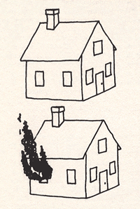

class: middle, clear

```{r setup, include=FALSE}
options(htmltools.dir.version = FALSE)
knitr::opts_chunk$set(dev = 'svg')
library(gridExtra)
library(dplyr)
```

## 1. Comparing paradigms

## 2. Discrete prior

## 3. Continuous prior

---

# Marshall & Halligan (1988)

.pull-left[
```{r echo=FALSE}

```
]

.pull-right[
.large[

Simplified version of the study:

- Patient (P.S.) presented with two cards in random order

- Asked to identify which house she would rather live in

- $Y=$ # times P.S. chose non-burning house

]
]

.footnote[
.footnotesize[
Marshall, J. C., & Halligan, P. W. (1988). Blindsight and insight in visuo-spatial neglect. *Nature*, 336(6201), 766.
]
]


---

# Analyze the data

.Large[
Take 5 minutes and draw a conclusion about $\theta$

Feel free to collaborate with your neighbor(s)
]

---

# The frequentist paradigm

.content-box-blue[
.Large[
A **frequentist procedure** quantifies uncertainty in terms of repeating the process that generated the data many times
]
]

---

# Would a frequentist ever claim that...

--

- .Large[
$P( Y > 14) = 0.75$?
]

--

- .Large[
$P( \theta > 0.5) = 0.75$?
]

--

- .Large[ 
$\theta \sim {\rm Unif}$(0.25, 0.5)?
]

--

- .Large[
the probability that the true proportion of correct guesses is in the interval (0.64, 1) is 0.95?
]

--

- .Large[
the probability that the null hypothesis, $H_0: \ \theta = 0.5$, is true is 0.0002?
]

---

# The Bayesian paradigm

.content-box-yellow[
.Large[
A **Bayesian procedure** quantifies uncertainty about the parameters that remain after accounting for prior knowledge and the information in the observed data
]
]

---

# Would a Bayesian ever claim that...

--

- .Large[
$P( Y > 14) = 0.75$?
]

--

- .Large[
$P( \theta > 0.5) = 0.75$?
]

--

- .Large[ 
$\theta \sim {\rm Unif}$(0.25, 0.5)?
]

--

- .Large[
the probability that the true proportion of correct guesses is in the interval (0.64, 1) is 0.95?
]

--

- .Large[
the probability that the null hypothesis, $H_0: \ \theta = 0.5$, is true is 0.0002?
]

---

class: middle, inverse

# Updating a discrete prior

---

# Design

.Large[

**Data:** N N N N <font color = "tomato">B B</font> N N N  <font color = "tomato">B</font> N N N N N N N (14 Ns; <font color = "tomato">3 Bs</font>)

<br>

**Data model:**

Some true proportion of guesses, $\theta$

Toss a coin with probability of heads, $\theta$

<br>

**Belief about $\theta$:**

Uniform over {0.1, 0.2, 0.3, 0.4, 0.5, 0.6, 0.7, 0.8, 0.9}

]

---

# Condition


.Large[

**Posterior distribution**

The distribution of $\theta$ that incorporates both the prior information and the data. 

i.e., the <font color = "#26A69A">**posterior**</font> is the <font color = '#FDD835'>**prior**</font> *conditioned* on <font color = '#9C27B0'>**evidence**</font>

<!-- 15 -->

$p(\theta | y) = {\rm Pr}(\theta = k | y)$


]

```{r include=FALSE}
library(dplyr)
blindsight <-
  data_frame(p =  seq(0.1, 0.9, by = .1)) %>% 
  mutate(
    prior = 1 / 9,                                  # recycles automatically
    likelihood =  dbinom(14, size = 17, prob = p),  # binomial likelihood
    unstd.prior = likelihood * prior,               # posterior plausibility
    posterior = unstd.prior / sum(unstd.prior)      # posterior probability
  )  
```

---
class: clear, center, middle

.Large[
```{r echo=FALSE}
# Formatting for printing
post_df <- blindsight
colnames(post_df) <- c("p", "prior probability", "likelihood", "posterior plausibility (prior x likelihood)", "posterior probability")
knitr::kable(post_df, format = "html", position = "float_right", align=rep('c', 5)) %>%
  kableExtra::column_spec(4, width = "2.5in") %>%
  kableExtra::column_spec(c(2,5), width = "1.5in")
```
]

---
class: clear, middle, center

```{r dev = 'svg', fig.width = 5, fig.height = 3, echo=FALSE, out.width = '100%'}
library(ggplot2)
ggplot(data = blindsight, aes(x = p)) +
  geom_point(aes(y = posterior, color = "posterior")) +
  geom_line(aes( y = posterior, color = "posterior")) +
  geom_point(aes(y = prior, color = "prior")) +
  geom_line(aes( y = prior, color = "prior")) +
  geom_point(aes(y = likelihood, color = "likelihood")) +
  geom_line(aes( y = likelihood, color = "likelihood")) +
  labs(x = "probability of guessing non-burning house", 
       y = "posterior probability") +
  scale_color_viridis_d("Component") +
  theme_minimal()
```

---
# Sequential updating

```{r dev = 'svg', fig.width = 9, fig.height = 5, echo=FALSE}
# Sequential updating
blindsight_data <- c("N", "N", "N", "N", "B", "B", "N", "N", "N", "B", "N", "N", "N","N", "N", "N", "N")
success <- cumsum(blindsight_data == "N")

post_plots <- list()

ps <- data_frame(p =  seq(0.1, 0.9, by = .1))
for(i in seq_along(success)) {
  if(i == 1) {
    update_df <- ps %>% mutate(prior = 1 / 9)
  } else {
    update_df <- update_df %>% select(p, prior = posterior)
  }
  
  update_df <- update_df %>%
    mutate(
    likelihood =  dbinom(success[i], size = i, prob = p),  # binomial likelihood
    unstd.prior = likelihood * prior,                      # posterior plausibility
    posterior = unstd.prior / sum(unstd.prior)             # posterior probability
  ) 
  
  tmp_plot <- 
    ggplot(data = update_df, aes(x = p)) +
    geom_point(aes(y = posterior, color = "posterior")) +
    geom_line(aes( y = posterior, color = "posterior")) +
    geom_point(aes(y = prior, color = "prior")) +
    geom_line(aes( y = prior, color = "prior"), linetype = 2) +
    labs(y = "plausibility",
         title = paste0(blindsight_data[1:i], collapse = "")) +
    theme_minimal() +
    theme(axis.title.x=element_blank(),
          axis.text.y=element_blank(),
          axis.ticks.y=element_blank(),
          legend.position="none",
          plot.title = element_text(size = 7)) +
    scale_color_manual(values = c("black", "gray70"))
  
  if(!i %in% c(1, 7, 13)) tmp_plot <- tmp_plot + theme(axis.title.y=element_blank())
  
  if(i %in% 1:12)  tmp_plot <- tmp_plot + ylim(0, .8)
  else  tmp_plot <- tmp_plot + ylim(0, 1)
  
  post_plots[[i]] <- tmp_plot 
}
n <- length(post_plots)
nCol <- 6
do.call("grid.arrange", c(post_plots, ncol=nCol))
```


---

# Evaluate

.Large[
Bayesian inference must be supervised

- Did the model malfunction?

- Does the model's answer make sense?

- Does the question make sense?

- Check sensitivity of the answer to changes in the assumptions
]

---

class: middle, inverse

# Updating a continuous prior

---

# Design, redux

.Large[

**Data:** N N N N <font color = "tomato">B B</font> N N N  <font color = "tomato">B</font> N N N N N N N (14 Ns; <font color = "tomato">3 Bs</font>)

<br>

**Data model:**

Some true proportion of guesses, $\theta$

Toss a coin with probability of heads, $\theta$

<br>

**Belief about $\theta$:**

Uniform over (0, 1)

]

---

class: center, middle, clear

```{r echo=FALSE, out.width=575}
knitr::include_graphics("figs/002x006.png")
```


---
class: inverse

# Your turn

.Large[
- Break into groups

- Derive the posteriors

- Are you working with a conjugate family?
]
