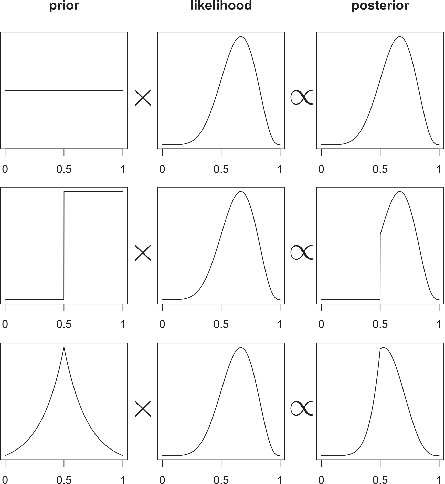

class: middle, clear

```{r setup, include=FALSE}
options(htmltools.dir.version = FALSE)
knitr::opts_chunk$set(dev = 'svg')
library(gridExtra)
library(dplyr)
library(ggplot2)
```

## 1. Updating a continuous prior

## 2. Summarizing the posterior

---
class: middle, inverse

# Updating a continuous prior

---

# Design, redux

.Large[

**Data:** N N N N <font color = "tomato">B B</font> N N N  <font color = "tomato">B</font> N N N N N N N (14 Ns; <font color = "tomato">3 Bs</font>)

<br>

**Data model:**

Some true proportion of guesses, $\theta$

Toss a coin with probability of heads, $\theta$

<br>

**Belief about $\theta$:**

Uniform over (0, 1)

]

---

class: center, middle, clear

```{r echo=FALSE, out.width=575}

```


---
class: inverse

# Your turn

.Large[
- Break into groups

- Derive the posteriors

- Are you working with a conjugate family?
]

---
class: middle, inverse 

# Summarizing the posterior

---

# Posterior analysis

.large[
> To a Bayesian, the best information one can ever have about $\theta$ is to know the posterior density.
>
> — Christensen, et al; *Bayesian Ideas and Data Analysis*, p. 31
]

.center[
```{r echo=FALSE, fig.height = 3, fig.width = 5, out.width = '75%'}
df <- tibble(theta = c(0, 1)) 

df %>%
  ggplot(aes(x = theta)) +
  stat_function(fun = dbeta, args = list(shape1 = 15, shape2 = 17 - 14 + 1)) +
  labs(x = expression(theta), y = "density") +
  theme_minimal()
```
]

---

# Point estimates

.Large[
- <font color = "#9C27B0"> <strong>Posterior mean</strong> </font>
- <font color = "#26A69A"> <strong>Posterior median </strong></font>
- <font color = "#FDD835"> <strong>Posterior mode </strong></font> — i.e. *maximum a posteriori* (MAP) estimate
]

.center[
```{r echo=FALSE, fig.height = 3, fig.width = 5, out.width = '80%'}
a <- 14 + 1
b <- 17 - 14 + 1
post_mean <- a / (a + b)
post_mode <- (a - 1) / (a + b - 2)
post_median <- qbeta(0.5, shape1 = a, shape2 = b)
df %>%
  ggplot(aes(x = theta)) +
  stat_function(fun = dbeta, args = list(shape1 = a, shape2 = b)) +
  geom_point(aes(x = post_mean, y = dbeta(post_mean, shape1 = a, shape2 = b), color = "mean")) +
  geom_point(aes(x = post_mode, y = dbeta(post_mode, shape1 = a, shape2 = b), color = "mode")) +
  geom_point(aes(x = post_median, y = dbeta(post_median, shape1 = a, shape2 = b), color = "median")) +
  labs(x = expression(theta), y = "density") +
  scale_color_viridis_d("Estimate") +
  theme_minimal() +
  theme(legend.position = "top")
```
]

---

# Credible intervals

.center[
```{r ci1, echo=FALSE, fig.height = 3, fig.width = 5, out.width = '80%'}
ci1 <- df %>%
  ggplot(aes(x = theta)) +
  stat_function(fun = dbeta, args = list(shape1 = a, shape2 = b)) +
  geom_area(stat = "function", fun = dbeta, args = list(shape1 = a, shape2 = b), 
            xlim = c(qbeta(0.055, a, b), qbeta(1 - 0.055, a, b)), alpha = 0.5, fill = "steelblue") +
  labs(x = expression(theta), y = "density",
       title = "89% equal-tailed credible interval") +
  scale_color_viridis_d("Estimate") +
  theme_minimal() +
  theme(legend.position = "top")
ci1
```
]

```{r}
# q*() functions calculate quantiles from the specified distribution
c(lower = qbeta(0.055, 14, 4), upper = qbeta(1 - 0.055, 14, 4))
```

---

# Credible intervals are not unique

.large[Here are three 89% credible intervals]

<br>

```{r ci2, echo=FALSE, fig.height = 2, fig.width = 7, out.width = '100%'}
ci1 <- ci1 + ggtitle(expression("(q"[0.055]*', q'[0.945]*")"))

ci2 <- df %>%
  ggplot(aes(x = theta)) +
  stat_function(fun = dbeta, args = list(shape1 = a, shape2 = b)) +
  geom_area(stat = "function", fun = dbeta, args = list(shape1 = a, shape2 = b), 
            xlim = c(qbeta(0.00001, a, b), qbeta(0.89, a, b)), alpha = 0.5, fill = "steelblue") +
  labs(x = expression(theta), y = "density",
       title = expression("(q"[0.00]*', q'[0.89]*")")) +
  scale_color_viridis_d("Estimate") +
  theme_minimal() +
  theme(legend.position = "top")

ci3 <- df %>%
  ggplot(aes(x = theta)) +
  stat_function(fun = dbeta, args = list(shape1 = a, shape2 = b)) +
  geom_area(stat = "function", fun = dbeta, args = list(shape1 = a, shape2 = b), 
            xlim = c(qbeta(0.11, a, b), qbeta(0.999999999, a, b)), alpha = 0.5, fill = "steelblue") +
  labs(x = expression(theta), y = "density",
       title = expression("(q"[0.11]*', q'[100]*")")) +
  scale_color_viridis_d("Estimate") +
  theme_minimal() +
  theme(legend.position = "top")

grid.arrange(ci1, ci2, ci3, ncol = 3)
```

---

# Highest Posterior Density Interval (HPDI)

.center[

```{r hpdi, fig.height = 3.5, fig.width = 6, echo=FALSE}
library(HDInterval) 
post_samples <- rbeta(1e5, a, b)

df %>%
  ggplot(aes(x = theta)) +
  stat_function(fun = dbeta, args = list(shape1 = a, shape2 = b)) +
  geom_area(stat = "function", fun = dbeta, args = list(shape1 = a, shape2 = b), 
            xlim = hdi(post_samples, credMass = 0.89), alpha = 0.5, fill = "steelblue") +
  labs(x = expression(theta), y = "density",
       title = "89% Highest Posterior Density Interval") +
  scale_color_viridis_d("Estimate") +
  theme_minimal() +
  theme(legend.position = "top")
```
]

---
class: center
```{r ci1, fig.height = 3, fig.width = 6, echo=FALSE}
```

```{r hpdi, fig.height = 3, fig.width = 6, echo=FALSE}
```

---

# Testing a hypothesis

.large[
Suppose the researchers were interested in testing


.pull-left[

$H_0: \theta \le 0.5$

$P(\theta \le 0.5 | Y = 14) = `r round(pbeta(0.5, a, b), 3)`$

```{r, echo=FALSE, fig.width = 3.5, fig.height = 2.5}

df %>%
  ggplot(aes(x = theta)) +
  stat_function(fun = dbeta, args = list(shape1 = a, shape2 = b)) +
  geom_area(stat = "function", fun = dbeta, args = list(shape1 = a, shape2 = b), 
            xlim = c(0, 0.5), alpha = 0.5, fill = "steelblue") +
  labs(x = expression(theta), y = "density") +
  theme_minimal() +
  theme(legend.position = "top")
```

]

.pull-right[

$H_1: \theta > 0.5$

$P(\theta > 0.5 | Y = 14) = `r 1 - round(pbeta(0.5, a, b), 3)`$

```{r, echo=FALSE, fig.width = 3.5, fig.height = 2.5}
df %>%
  ggplot(aes(x = theta)) +
  stat_function(fun = dbeta, args = list(shape1 = a, shape2 = b)) +
  geom_area(stat = "function", fun = dbeta, args = list(shape1 = a, shape2 = b), 
            xlim = c(0.5, 1), alpha = 0.5, fill = "steelblue") +
  labs(x = expression(theta), y = "density") +
  theme_minimal() +
  theme(legend.position = "top")
```
]

]