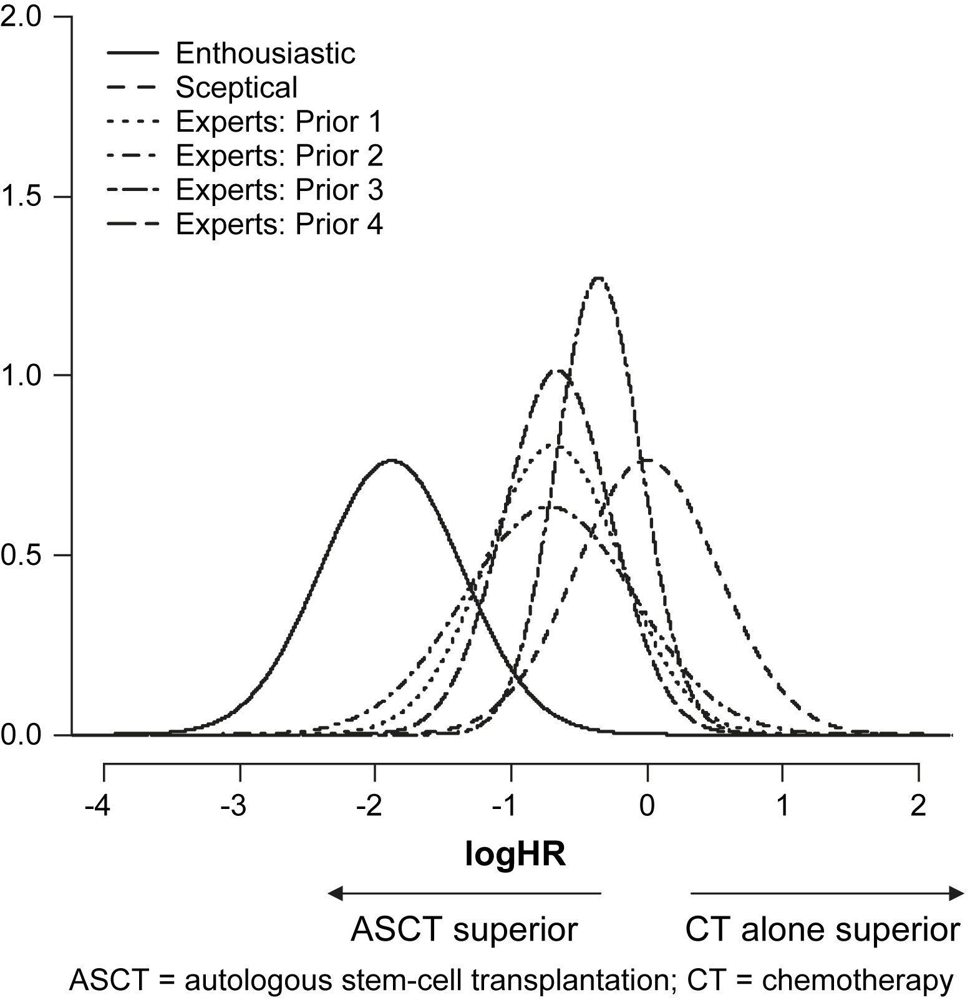

class: middle, clear

```{r setup, include=FALSE}
options(htmltools.dir.version = FALSE)
knitr::opts_chunk$set(dev = 'svg')
library(gridExtra)
library(dplyr)
library(ggplot2)
library(triangle)
library(ggthemes)
```

## 1. Data augmentation priors

## 2. Using domain expertise

---
class: inverse

# Your turn

.Large[
Suppose that you are asked to fit a regression model to predict whether a Carl likes to study on the first floor of the Libe.

What (frequentist) model would you choose?

What subjective decisions went into that choice?
]


---

# Conjugate priors

.large[
.content-box-blue[
A prior is **conjugate** if the posterior is a member of the
same parametric family
]

Examples we have seen:

- Binomial likelihood, Beta prior

- Poisson likelihood, Gamma prior

- Exponential likelihood, Gamma prior

Here's a [longer list of conjugate priors](https:
//en.wikipedia.org/wiki/Conjugate_prior)

]

---

# Beta-binomial model for a proportion

.large[
A fundamental task in statistics is to estimate a proportion
using a series of trials:

- What is the success probability of a new cancer treatment?

- What proportion of voters support my candidate?

- What proportion of the population has a rare gene?
]

--
.large[
**Target:** estimate of the true proportion, $\theta$

* obtain the posterior

* calculate a 95% interval

* test whether $\theta$ equals some predetermined value $\theta_0$
]

---

# Beta-binomial model for a proportion

.left-column[

## Assumption

## Likelihood

## Prior

## Posterior

]

.right-column[

.large[
we have *n* independent and identically distributed (iid) success/failure trials<br><br>


$Y|\theta \sim \text{Binomial}(n, \theta)$ <br> <br>

$\theta \in [0, 1]$, so Beta(*a*, *b*) is a good choice<br> <br>

$\theta |Y \sim \text{Beta}(a + Y, b + n − Y)$
]

]

---

# How do we set a and b?

.large[The Beta distribution is **very** flexible, so we need to choose wisely.]


```{r dev = 'svg', fig.width = 5, fig.height = 4, echo=FALSE, fig.align='center', out.width = "75%"}
curve_colors <- ggthemes::colorblind_pal()(7)

a <- c(.5, .5, 1.8, 6, 6,   5)
b <- c(.5, 6 , 6,   6, 1.8, 1)
par(mar = c(4, 4, .25, .25))
curve(dbeta(x, shape1 = 1, shape2 = 1), from = 0, to = 1, ylim = c(0, 6), ylab = "f(x)", col = curve_colors[1], lwd = 2)
for(i in seq_along(a)) {
  curve(dbeta(x, shape1 = a[i], shape2 = b[i]),  from = 0, to = 1, add = TRUE, col = curve_colors[i+1], lwd = 2, lty = i+1)
}
legend("top", legend = c("Beta(1, 1)", "Beta(.5, .5)", "Beta(.5, 6)", "Beta(1.8, 6)", "Beta(6, 6)", "Beta(6, 1.8)", "Beta(5, 1)"), col = curve_colors, lty = 1:7, lwd = 2)
```

---
class: inverse

# Your turn
.large[
When (in terms of *n*, *a*, and *b*) is the $\widehat{\theta}$ close to the sample mean, *Y*/*n*?

<br>

<br>


When  is the $\widehat{\theta}$ shrunk towards the prior mean, $a/(a+b)$?
]

---

# Example

.left-column[

## Setting

## Data

## Likelihood

## Prior

## Posterior

]

.right-column[

.large[
Assessing proportion of U.S. transportation industry workers who use drugs on the job.<br><br>

RS of size $n=10$ taken; $Y = 2$ positive tests
<br><br>


$Y|\theta \sim \text{Binomial}(n=10, \theta)$ <br> <br>

Based on prior testing, $\text{Beta}(a=3, b=23)$<br> <br>

$\theta |Y \sim \text{Beta}(5, 31)$
]

]

---

.pull-left[

# Example 

.large[

- Posterior $\propto$ Prior $\times$ Likelihood


- Posterior can't have density anywhere prior density is 0

- If prior "dominates" the likelihood, then the data have very little to contribute to the analysis!

]
]

.pull-right[


```{r dev = 'svg', fig.width = 3, fig.height = 3.5, echo=FALSE, fig.align='center', out.width = "85%"}
bb_informative <-
  tibble(theta =  seq(0, 1, by = .001)) %>% 
  mutate(
    prior = dbeta(theta, 3, 23),
    likelihood =  dbinom(2, size = 10, prob = theta),
    unstd.posterior = likelihood * prior,              
    posterior = unstd.posterior / sum(unstd.posterior) 
  ) 
```

```{r dev = 'svg', fig.width = 2.25, fig.height = 6.75, echo=FALSE, fig.align='center', out.height = "75%"}
p1 <- ggplot(data = bb_informative, aes(x = theta)) +
  geom_line(aes( y = prior), color = "#000000") +
  labs(x = expression(theta), 
       y = "density") +
  theme_minimal() +
  ggtitle("Prior")

p2 <- ggplot(data = bb_informative, aes(x = theta)) +
  geom_line(aes( y = likelihood), color = "#E69F00") +
  labs(x = expression(theta), 
       y = "density") +
  theme_minimal() +
  ggtitle("Likelihood")

p3 <- ggplot(data = bb_informative, aes(x = theta)) +
  geom_line(aes( y = posterior), color = "#56B4E9") +
  labs(x = expression(theta), 
       y = "posterior density") +
  theme_minimal() +
  theme(legend.position = "top") +
  ggtitle("Posterior")

grid.arrange(p1, p2, p3, ncol = 1)
```


]


---

# A "weak" prior

.left-column[

## Setting

## Data

## Likelihood

## Prior

## Posterior

]

.right-column[

.large[
Assessing proportion of U.S. transportation industry workers who use drugs on the job.<br><br>

RS of size $n=10$ taken; $Y = 2$ positive tests
<br><br>


$Y|\theta \sim \text{Binomial}(n=10, \theta)$ <br> <br>

No prior info so analyst sets $\text{Beta}(a=1/10, b=1/10)$<br> <br>

$\theta |Y \sim \text{Beta}(2.1, 10.1)$
]

]

---

.pull-left[

# A "weak" prior

.large[
- Likelihood dominates the prior

- The data almost entirely determine the posterior
]
]

.pull-right[


```{r dev = 'svg', fig.width = 3, fig.height = 3.5, echo=FALSE, fig.align='center', out.width = "85%"}
bb_uninformative <-
  tibble(theta =  seq(0.001, 0.999, by = .001)) %>% 
  mutate(
    prior = dbeta(theta, .1, .1),
    likelihood =  dbinom(2, size = 10, prob = theta),
    unstd.posterior = likelihood * prior,              
    posterior = unstd.posterior / sum(unstd.posterior) 
  ) 
```

```{r dev = 'svg', fig.width = 2.25, fig.height = 6.75, echo=FALSE, fig.align='center', out.height = "75%"}
w1 <- ggplot(data = bb_uninformative, aes(x = theta)) +
  geom_line(aes( y = prior), color = "#000000") +
  labs(x = expression(theta), 
       y = "density") +
  theme_minimal() +
  ggtitle("Prior")

w2 <- ggplot(data = bb_uninformative, aes(x = theta)) +
  geom_line(aes( y = likelihood), color = "#E69F00") +
  labs(x = expression(theta), 
       y = "density") +
  theme_minimal() +
  ggtitle("Likelihood")

w3 <- ggplot(data = bb_uninformative, aes(x = theta)) +
  geom_line(aes( y = posterior), color = "#56B4E9") +
  labs(x = expression(theta), 
       y = "posterior density") +
  theme_minimal() +
  theme(legend.position = "top") +
  ggtitle("Posterior")

grid.arrange(w1, w2, w3, ncol = 1)
```

]

---


# A "flat" prior

.left-column[

## Setting

## Data

## Likelihood

## Prior

## Posterior

]

.right-column[

.large[
Assessing proportion of U.S. transportation industry workers who use drugs on the job.<br><br>

RS of size $n=10$ taken; $Y = 2$ positive tests
<br><br>


$Y|\theta \sim \text{Binomial}(n=10, \theta)$ <br> <br>

No prior info so analyst sets $\text{Beta}(a=1, b=1)$<br> <br>

$\theta |Y \sim \text{Beta}(3, 11)$
]

]

---

.pull-left[

# A "flat" prior

.large[
- Likelihood dominates the prior

- The data almost entirely determine the posterior
]
]

.pull-right[


```{r dev = 'svg', fig.width = 3, fig.height = 3.5, echo=FALSE, fig.align='center', out.width = "85%"}
bb_flat <-
  tibble(theta =  seq(0, 1, by = .001)) %>% 
  mutate(
    prior = dbeta(theta, 1, 1),
    likelihood =  dbinom(2, size = 10, prob = theta),
    unstd.posterior = likelihood * prior,              
    posterior = unstd.posterior / sum(unstd.posterior) 
  ) 
```

```{r dev = 'svg', fig.width = 2.25, fig.height = 6.75, echo=FALSE, fig.align='center', out.height = "75%"}
f1 <- ggplot(data = bb_flat, aes(x = theta)) +
  geom_line(aes( y = prior), color = "#000000") +
  labs(x = expression(theta), 
       y = "density") +
  theme_minimal() +
  ggtitle("Prior")

f2 <- ggplot(data = bb_flat, aes(x = theta)) +
  geom_line(aes( y = likelihood), color = "#E69F00") +
  labs(x = expression(theta), 
       y = "density") +
  theme_minimal() +
  ggtitle("Likelihood")

f3 <- ggplot(data = bb_flat, aes(x = theta)) +
  geom_line(aes( y = posterior), color = "#56B4E9") +
  labs(x = expression(theta), 
       y = "posterior density") +
  theme_minimal() +
  theme(legend.position = "top") +
  ggtitle("Posterior")

grid.arrange(f1, f2, f3, ncol = 1)
```

]

---
class: center, middle

# Using domain expertise

---

# Example

.large[
Through prior elicitation you determine the following information:

- The researchers *expect* the probability of success, $\theta$, to be 2/3

- The researchers believe there is only a 5% chance that $\theta > 0.9$
]

---

```{r message=FALSE}
# Load BB so that we get access to BBsolve()
library(BB)

# define function for the mean of Beta(a, b) dsn
beta.mean <- function(x) x[1] / (x[1] + x[2])

# set up a system of equations to solve
# 2/3 and 0.9 are the elicited values
beta.solve <- function(x){
  obj1 <- beta.mean(x) - 2 / 3           # mean - desired value
  obj2 <- qbeta(0.95, x[1], x[2]) - 0.9  # quantile - desired value
  return(c(obj1, obj2))
  }

# BBsolve(<intial guess>, <system of eqns as function>)
beta.params <- BBsolve(c(1,1), beta.solve, quiet = TRUE)
beta.params$par
```


```{r echo=FALSE, fig.height=2, fig.width=5, fig.align='center'}
df <- tibble(theta = c(0, 1)) 

a <- beta.params$par[1]; b <- beta.params$par[2]

df %>%
  ggplot(aes(x = theta)) +
  stat_function(fun = dbeta, args = list(shape1 = a, shape2 = b)) +
  geom_area(stat = "function", fun = dbeta, args = list(shape1 = a, shape2 = b), 
            xlim = c(0.9, 1), alpha = 0.5, fill = "steelblue") +
  labs(x = expression(theta), y = "density") +
  theme_minimal()

# add this prior to the grid
blindsight.grid <- tibble(theta = seq(0, 1, by = 0.001)) %>%
  mutate(beta.ab.prior = dbeta(theta, shape1 = a, shape2 = b))
```

???

You could check whether you found the right beta

`qbeta(0.95, a, b) = 0.9`

Check a / (a + b)

---

# The prior predictive distribution

.content-box-blue[
Simulate data implied by your prior specification to see if it seems reasonable
]

```{r}
prior_thetas <- rbeta(1e5, shape1 = 5.268, shape2 = 2.634)
prior_preds  <- rbinom(1e5, size = 17, prob = prior_thetas)
```

```{r dev='svg', fig.width = 6, fig.height = 3.5, fig.align='center', echo=FALSE, warning=FALSE, out.width = "70%"}
ggplot(data.frame(x = prior_preds)) +
  geom_bar(mapping = aes(x = x), width = .5, alpha = 0.7) +
  xlim(c(0, 17)) +
  labs(x = "Y",
       title = "Prior predictive: Beta(5.268, 2.634)") +
  theme_minimal()
```


???

A predictive distribution that integrates over unknown parameters but is not conditional on observed data is called a prior predictive distribution. **Such a distribution can be useful in evaluating if a prior distribution for $\theta$ actually translates into reasonable prior beliefs for observable data.**

---

# Sensitivity analysis
.large[
.content-box-blue[
Any time informative priors are used you should conduct a
**sensitivity analysis**
]

- Compare the posterior for several priors

- Describe how the posterior changes

- Example: [https:
//www.ncbi.nlm.nih.gov/pubmed/19010642](https:
//www.ncbi.nlm.nih.gov/pubmed/19010642)
]

---


```{r echo=FALSE, out.width = "70%", fig.align='center'}

```


.footnote[
.small[
<br>

Source: [https://www.ncbi.nlm.nih.gov/pubmed/19010642](https:
//www.ncbi.nlm.nih.gov/pubmed/19010642)
]
]


---

# Poisson-gamma model for a rate

.large[
A fundamental task in statistics is to estimate a rate of occurrence:

- Number of virus attacks per day on a computer network

- Number of Ebola cases per day

- Number of diseased trees per square mile in a forest
]

--
.large[
**Target:** estimate of the true rate, $\lambda$

* Make observations over time period of length *N* OR make observations over region of area *N* 

* Observe $Y = 0, 1, 2, \ldots$ events

* Obtain the posterior, calculate a 95% interval, test a claim about $\lambda$ 
]

---

# Poisson-gamma model for a rate

.left-column[

## Assumption

## Likelihood

## Prior

## Posterior

]

.right-column[

.large[
Constant rate of occurrence over unit of time/space<br><br>


$Y|\lambda \sim \text{Poisson}(N\lambda)$ <br> <br>

$\lambda > 0$, so Gamma(*a*, *b*) is a good choice<br> <br>

$\lambda |Y \sim \text{Gamma}(a + Y, b + N)$
]

]

---
class: inverse
# Your turn

.large[
$$\widehat{\lambda} = E(\lambda | Y) = \dfrac{a + Y}{b+N} = (1-w) \dfrac{a}{b} + w \dfrac{Y}{n}$$

1. Find an expression for $w$.

2. Describe $Y/N$ and $a/b$ in words.

3. If we view Gamma(*a*, *b*) as a data augmentation prior, what do *a* and *b* represent?

4. When (in terms of *N*, *a*, and *b*) is  $\widehat{\lambda}$ close to $Y/N$? How does this help you set a "weak" prior?

5. When (in terms of *N*, *a*, and *b*) is  $\widehat{\lambda}$ shrunk towards $a/b$?
]