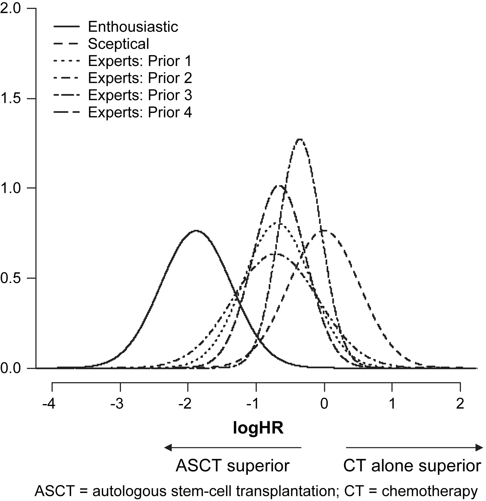

class: middle, clear

```{r setup, include=FALSE}
options(htmltools.dir.version = FALSE)
knitr::opts_chunk$set(dev = 'svg')
library(gridExtra)
library(dplyr)
library(ggplot2)
library(triangle)
library(ggthemes)
```

## 1. Poisson-gamma example

## 2. Prior predictive distribution

## 3. Mixture priors

## 4. Natural conjugate priors

---

# Poisson-gamma model for a rate

.large[
A fundamental task in statistics is to estimate a rate of occurrence:

- Number of virus attacks per day on a computer network

- Number of Ebola cases per day

- Number of diseased trees per square mile in a forest
]

--
.large[
**Target:** estimate of the true rate, $\lambda$

* Make observations over time period of length *N* OR make observations over region of area *N* 

* Observe $Y = 0, 1, 2, \ldots$ events

* Obtain the posterior, calculate a 95% interval, test a claim about $\lambda$ 
]

---

# Poisson-gamma model for a rate

.left-column[

## Assumption

## Likelihood

## Prior

## Posterior

]

.right-column[

.large[
Constant rate of occurrence over unit of time/space<br><br>


$Y|\lambda \sim \text{Poisson}(N\lambda)$ <br> <br>

$\lambda > 0$, so Gamma(*a*, *b*) is a good choice<br> <br>

$\lambda |Y \sim \text{Gamma}(a + Y, b + N)$
]

]

---
class: inverse
# Your turn

.Large[
$$\widehat{\lambda} = E(\lambda | Y) = \dfrac{a + Y}{b+N} = (1-w) \dfrac{a}{b} + w \dfrac{Y}{n}$$

1. Find an expression for $w$.

2. Describe $Y/N$ and $a/b$ in words.

3. If we view Gamma(*a*, *b*) as a data augmentation prior, what do *a* and *b* represent?

4. When (in terms of *N*, *a*, and *b*) is  $\widehat{\lambda}$ close to $Y/N$? How does this help you set a "weak" prior?

5. When (in terms of *N*, *a*, and *b*) is  $\widehat{\lambda}$ shrunk towards $a/b$?
]

---
class: inverse
# Your turn

.Large[
Suppose that causes of death in 2018 are reviewed in detail for a city with a population of 200,000. It is found that 3 people died of asthma, giving a crude estimated asthma mortality rate in the city of 1.5 cases per 100,000 people per year.

You propose the Poisson model $Y|\lambda \sim \text{Poisson}(2 \lambda)$, where $\lambda$ denotes the true underlying long-term asthma mortality rate in the city, measured in cases per 100,000 people per year.

Reviews of asthma mortality rates around the world suggest that mortality rates about 1.5 per 100,000 people are rare in Western countries, with typical asthma mortality rates around 0.6 per 100,000. 

]

---

# Prior predictive distribution

.content-box-blue[
Simulate data implied by your prior specification to see if it seems reasonable
]

```{r echo=FALSE}
S <- 1e4
a <- 3
b <- 5
```


```{r}
# Be sure to set S, a, and b
prior_lambdas <- rgamma(S, a, b)        # draw lambdas
prior_ys <- rpois(S, 2 * prior_lambdas) # draw ys
```

```{r dev='svg', fig.width = 5.5, fig.height = 3.25, fig.align='center', echo=FALSE, warning=FALSE, out.width = "65%"}
ggplot(data.frame(x = prior_ys)) +
  geom_bar(mapping = aes(x = x), width = .5, alpha = 0.7) +
  labs(x = "Y") +
  scale_x_continuous(breaks = -1:10, minor_breaks = NULL, limits = c(-.25, 10)) +
  theme_minimal()
```


???

A predictive distribution that integrates over unknown parameters but is not conditional on observed data is called a prior predictive distribution. **Such a distribution can be useful in evaluating if a prior distribution for $\theta$ actually translates into reasonable prior beliefs for observable data.**

---

# Sensitivity analysis
.large[
.content-box-blue[
Any time informative priors are used you should conduct a
**sensitivity analysis**
]

- Compare the posterior for several priors

- Describe how the posterior changes

- Example: [https:
//www.ncbi.nlm.nih.gov/pubmed/19010642](https:
//www.ncbi.nlm.nih.gov/pubmed/19010642)
]

---


```{r echo=FALSE, out.width = "70%", fig.align='center'}

```


.footnote[
.small[
<br>

Source: [https://www.ncbi.nlm.nih.gov/pubmed/19010642](https:
//www.ncbi.nlm.nih.gov/pubmed/19010642)
]
]


---

# Combining prior knowledge

.large[

- Prior information can come from a variety of sources

- Say that source $j$ (e.g., journal article, expert, pilot study)
suggests prior $\pi_j(\theta)$

- A mixture of experts prior combines the $j$ sources into a
single prior distribution
]

---

# Mixture prior

Suppose we have two experts consulted for the asthma mortality example

.pull-left[
**Expert 1**:

- $E(\lambda) = a/b  = 0.6$ 
- $\displaystyle\int_0^{1.5} \pi(\lambda | a, b) d\lambda = 0.975$

$\Rightarrow\lambda \sim \text{Gamma}(a = 2.7, b = 4.5)$
]

.pull-right[
**Expert 2**

- ${\rm mode} (\lambda) = (a-1)/b =  0.8$ 
- $\displaystyle\int_0^{2} \pi(\lambda | a, b) d\lambda = 0.95$

$\Rightarrow\lambda \sim \text{Gamma}(a = 4.2, b = 4)$

]

```{r echo=FALSE, fig.width = 4, fig.height = 2.5, fig.align = "center"}
df <- tibble(lambda = c(0, 10))
df %>%
  ggplot(aes(x = lambda)) +
  stat_function(aes(linetype = "Expert 1"), fun = dgamma, args = list(shape = 2.7, rate = 4.5), n = 1000) +
  stat_function(aes(linetype = "Expert 2"),fun = dgamma, args = list(shape = 4.2, rate = 4), n = 1000) +
  labs(x = expression(theta), y = "density") +
  theme_minimal() +
  scale_linetype_discrete("") +
  theme(legend.position = c(.8, .9))
```

---

# Computing with a mixture prior

.large[
Suppose we give expert 1 weight $w_1 = 0.6$ and expert 2 weight $w_2 = 0.4$

```{r}
lambda <- seq(0, 10, by = 0.001)
prior  <- 
  0.6 * dgamma(lambda, 2.7, 4.5) + 0.4 * dgamma(lambda, 4.2, 4)
```
]

```{r echo=FALSE, fig.width = 4, fig.height = 2.5, fig.align = "center", out.width = "70%"}
df <- tibble(lambda = lambda)
df %>%
  ggplot(aes(x = lambda)) +
  stat_function(aes(linetype = "Expert 1"), fun = dgamma, args = list(shape = 2.7, rate = 4.5), n = 1000) +
  stat_function(aes(linetype = "Expert 2"),fun = dgamma, args = list(shape = 4.2, rate = 4), n = 1000) +
  geom_line(aes(x = lambda, y = prior, linetype = "60:40 mixture"), inherit.aes = FALSE) +
  labs(x = expression(theta), y = "density") +
  theme_minimal() +
  scale_linetype_discrete("") +
  theme(legend.position = c(.8, .9))
```

---

# Natural conjugate priors

.content-box-yellow[
.large[
Is there a natural way of constructing a class of conjugate priors given a specific sampling density, $f(y|\theta)$?

*Answer:* Yes, for most of the distributions we have seen in stats up to this point <br>(i.e. *the exponential family of distributions*)

]

]

---

# Exponential family of distributions

.content-box-blue[
A family of PDFs/PMFs is an exponential family if it can be expressed as

$$f(y | \theta) = h(x) c(\theta) \exp \left( \sum_{i=1}^k w_i(\theta) t_i(x) \right)$$

Note: $k=1$ for a single-parameter model
]

--

Notice that

$$f(y | \theta) \propto c(\theta) \exp \left( \sum_{i=1}^k w_i(\theta) t_i(x) \right)$$

$t_i(x)$ is said to be a *sufficient statistic* for $\theta$ 

---
class:inverse, middle, center

#Nonconjugate prior elicitation

---

# Histogram approach

.large[

Sometimes it's easier to get a researcher/expert to choose a set of sub-intervals and assign probabilities or relative likelihoods to those intervals.

1. Bin the parameter space

1. Decide on the amount of probability (or the relative "likelihood") in each bin

1. Normalize if required
]


---

class: clear


```{r}
# Create a histogram prior using LearnBayes::histprior()
library(LearnBayes)
theta <- seq(0, 1, by = 0.001)
mid_points <- seq(0.05, 0.95, by = .1)
prior_likelihood <- c(1, 1, 1, 1, 2, 4, 8, 8, 4, 2)
prior_prob <- prior_likelihood / sum(prior_likelihood)

# Calc. prior probability for every point on the theta grid 
prior <- histprior(theta, mid_points, prior_prob)
```


```{r fig.height=2.5, fig.width=6, echo=FALSE, fig.align='center', out.width="100%"}
ggplot(data = NULL) +
  geom_line(mapping = aes(x = theta, y = prior)) +
  labs(x = expression(theta),
       y = "Prior probabilities") +
  theme_minimal()
```


---

# Relative likelihood approach


.large[

Instead of choosing intervals, you can have guide an expert to specify key points of a frequency polygon that you can then "fill in".


1. Identify the "most likely" and "least likely" points in the parameter space

1. Determine the relative "likelihood" for several more points

1. Interpolate (usually linearly)

1. Normalize
]

???

This takes the histogram prior approach a step farther. Instead of choosing intervals, you're essentially trying to construct a key points of a frequency polygon that you can then "fill in".

---

class: clear

```{r}
# set up your prior beliefs
key_thetas <- seq(0, 1, by = 0.1)
prior_likelihood <- c(1, 1, 1, 1, 1, 2, 4, 8, 8, 4, 2)
prior_prob <- prior_likelihood / sum(prior_likelihood)

# interpolate to get the prior via approxfun()
rel_likelihood <- approxfun(x = key_thetas, y = prior_prob, method = "linear")

# add the prior probs on the grid
theta <- seq(0, 1, by = 0.001)
prior <- rel_likelihood(theta)
```


```{r fig.height=2.5, fig.width=6, echo=FALSE, fig.align='center', out.width="100%"}
ggplot(data = NULL) +
  geom_line(mapping = aes(x = theta, y = prior)) +
  labs(x = expression(theta),
       y = "Prior probabilities") +
  theme_minimal()
```
