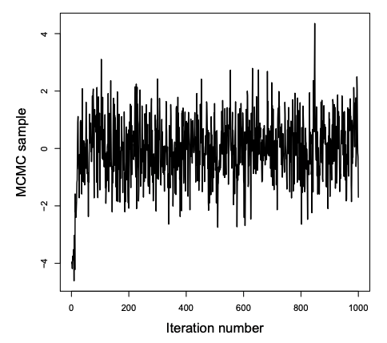

class: clear, middle

```{r setup, include=FALSE}
options(htmltools.dir.version = FALSE)
knitr::opts_chunk$set(dev = 'svg')
library(gridExtra)
library(ggplot2)
library(ggthemes)
library(LearnBayes)
```

# Quick rundown of midterm eval results

---


# Long-run behavior of Markov chains

.large[

For .bold[irreducible, aperiodic] Markov chains, the fraction of time a chain will spend in each of its recurrent states is given by the .bold[stationary distribution] (a.k.a. steady state)

<br>

.content-box-blue[
${\boldsymbol s} = (s_1, s_2, \ldots, s_n)$ is a stationary distribution if

${\boldsymbol s Q} = {\boldsymbol s}$  
]


]

---

# Important properties of Markov chains


.large[

.bolder[Theorem.] For any irreducible Markov Chain

1. A stationary distribution exists

1. The stationary distribution is unique

1. $s_i = 1 / r_i$, where $r_i$ is the expected # of steps required to return to state *i*

1. If ${\boldsymbol Q}^m$ is strictly positive for some $m$, then

    $$\lim_{n \to \infty}P(X_n = i) = s_i$$

.content-box-yellow[
So, for an arbitrary probability vector $\boldsymbol t$, ${\boldsymbol t Q}^n \to {\boldsymbol s}$ as $n \to \infty$
]
]

---
class: inverse

# Your turn: Monte Carlo sampling

.Large[
$\theta^{(1)}, \ldots, \theta^{(S)}$ are samples from the posterior, $p(\boldsymbol \theta | {\bf Y})$

Turn to your neighbor and discuss the following:

- How would you estimate the posterior mean and standard deviation?

- How would you calculate a 97% credible interval? 
]

---

# Example
.large[
.bold[How did the support for GOP presidential candidates change between the 2012 and 2016 elections?]


Variable | Description
----------|------------------------------
`fips`  | 5-digit code: 2-digit state code, by 3-digit county
`area_name`     | name of the county
`total_2012` | total votes cast in 2012
`gop_2012`   | votes cast for GOP candidate in 2012
`total_2016` | total votes cast in 2016
`gop_2016`   | votes cast for GOP candidate in 2012
`...`        | there are other variables...
]

Source: https://github.com/tonmcg/County_Level_Election_Results_12-16 <br> Note: Alaska is omitted from this data set

```{r echo=FALSE}
votes <- read.csv("data/County_Election_08_16.csv")
votes <- votes[,1:16]
```

---

# Example 

.large[
Interest is in the .bold[percent change] in GOP support

- $A_i = \#$ GOP votes in 2012 in county $i = 1, \ldots, n$

- $B_i = \#$ GOP votes in 2016 in county $i = 1, \ldots, n$

- $Y_i = 100(B_i/A_i - 1)$

- $n=3,112$
]


```{r message=FALSE}
library(dplyr)
votes <- mutate(
  votes, 
  gop_pct_2016 = gop_2016 / total_2016,
  gop_pct_2012 = gop_2012 / total_2012,
  pct_change   = 100 * (gop_pct_2016 / gop_pct_2012 - 1)
)
```

---

# Model

.large[
$Y_i = 100(B_i/A_i - 1)$, the percent change in support

$$
\begin{align}
Y_i | \mu, \sigma^2 &\overset{\rm iid}{\sim} \mathcal{N}(\mu, \sigma^2) & \qquad \qquad \qquad \qquad \qquad \qquad \qquad \qquad \phantom{text}\\
\mu & \sim \mathcal{N}(\mu_0, \sigma^2_0) &\\
\sigma^2 & \sim {\rm InvGamma}(a, b) &\\
\mu &\perp \sigma^2
\end{align}
$$

Let's use uninformative priors:

$$
\begin{align}
\mu_0 &= 0 & \qquad \qquad \qquad \qquad \qquad \qquad \phantom{text}\\
\sigma^2_0 &= 1000 &\\
a &= 0.1 &\\
b &= 0.1 &\\
\end{align}
$$

]

---
class: inverse

# Your turn

.Large[
Turn to your neighbor and discuss how you could check whether this prior was reasonable and/or uninformative
]

---

# Prior predictive check
```{r fig.width = 4, fig.height = 3.5, echo=FALSE, warning=FALSE, message=FALSE, out.width = "60%", fig.align='center'}
library(LearnBayes)
library(ggplot2)
mu0s   <- rnorm(1e4, 0, sqrt(1000))
sig20s <- rigamma(1e4, 0.1, 0.1)
y0s    <- rnorm(1e4, mu0s, sqrt(sig20s))

ggplot(data = NULL) +
  geom_histogram(aes(x = y0s)) +
  lims(x = c(-200, 200)) +
  theme_light() +
  labs(title = "Prior predictive distribution", x = "Pct change")
```

.large[
If you don't think the priors induce a reasonable distribution on $Y$, then tweak the parameters (e.g. inflate $\sigma^2_0$)
]


---

# Posterior

.large[


$$
\begin{align}
\mu, \sigma^2 | {\bf Y} &\propto \pi(\mu) \pi(\sigma^2) \cdot \prod_{i=1}^n f(y_i | \mu, \sigma^2)\\
  &\propto \exp \left[ - \dfrac{(\mu - \mu_0)^2}{2 \sigma^2_0} \right] \cdot \left(\sigma^2 \right)^{-a-1} \exp\left[ - \dfrac{b}{\sigma^2} \right] \cdot \\
  &\quad  \prod_{i=1}^n \left(\sigma^2 \right)^{-1/2} \exp\left[ - \dfrac{(y_i - \mu)^2}{2 \sigma^2} \right]
\end{align}
$$

.content-box-yellow[
If we can sample from the posterior, we can avoid some tedious (and sometimes impossible) calculus!
]

]

---

# Road map

.pull-left[
.large[
.bold[Where we've been]

Grid (brute force) approximation

- rather slow

- scales horribly


Bayesian CLT

- fast

- requires roughly normal posterior

- doesn't scale well
]
]

--

.pull-right[
.large[
.bold[Where we're going]

Markov Chain Monte Carlo = MCMC

- Generate a Markov chain where the posterior is the stationary distribution 

- Start from some initial guess $\theta^{(0)}$ and let the chain run for a long time so that it reaches its stationary distribution
]
]

---

# Two-stage Gibbs sampler

.large[

.bold[Target:] samples from $p(\theta_1, \theta_2 | {\bf Y})$

.bold[Algorithm:] 

1. Set initial values for parameter values, $\boldsymbol{\theta}^{(0)} = \left(\theta^{(0)}_1, \theta^{(0)}_2 \right)$

2. Draw $\theta_1^{(1)}$ from $p(\theta_1 | \theta_2, {\bf Y})$ 

3. Draw $\theta_2^{(1)}$ from $p(\theta_2 | \theta_1, {\bf Y})$ 

4. Repeat steps 2-3 $S$ times

After convergence, draws $\left( \theta_1^{(k)}, \theta_2^{(k)} \right)$ are from the posterior distribution
]

---
class: inverse

# Your turn

.Large[

In our example, $\boldsymbol{\theta} = (\mu, \sigma^2)$

Discuss with your neighbor .bolder[how] you would find the following conditional posterior distributions from the joint posterior:

1. $\mu | \sigma^2, {\bf Y}$

1. $\sigma^2 | \mu, {\bf Y}$
]

---

## Full conditional distributions


$$
\begin{align}
p(\sigma^2 | {\boldsymbol Y}, \mu) &= \dfrac{f({\boldsymbol Y} | \sigma^2, \mu) \pi(\sigma^2) \pi(\mu)}{f({\boldsymbol Y})}\\
&\propto f({\boldsymbol Y} | \sigma^2, \mu) \pi(\sigma^2)\\
&\propto \left[ \prod_{i=1}^n \left(\sigma^2 \right)^{-1/2} \exp\left( - \dfrac{(y_i - \mu)^2}{2 \sigma^2} \right) \right] \left[\left(\sigma^2 \right)^{-a-1} \exp\left( - \dfrac{b}{\sigma^2} \right) \right]\\
&= \left[ \left(\sigma^2 \right)^{-n/2} \exp\left(- \frac{{\rm SSE}}{2 \sigma^2} \right) \right]  \left[\left(\sigma^2 \right)^{-a-1} \exp\left( - \dfrac{b}{\sigma^2} \right) \right]\\
&= \left(\sigma^2 \right)^{-\left(\frac{n}{2} + a \right) - 1} \exp\left( - \frac{{\rm SSE/2 + b}}{ \sigma^2} \right) 
\end{align}
$$

<br>

.large[
.bold[
Is this a distribution we know?
]
]

---


$$
\begin{align}
p(\mu | {\boldsymbol Y}, \sigma^2) &= \dfrac{f({\boldsymbol Y} | \sigma^2, \mu) \pi(\sigma^2) \pi(\mu)}{f({\boldsymbol Y})}\\
&\propto f({\boldsymbol Y} | \sigma^2, \mu) \pi(\mu)\\
&\propto \exp\left[ - \dfrac{ \sum(y_i - \mu)^2}{2 \sigma^2} \right] \exp\left[ - \dfrac{(\mu - \mu_0)^2}{2 \sigma_0^2} \right]\\
&= \exp\left[ -\frac{1}{2} \left( \frac{\sum y_i^2}{\sigma^2} - 2 \frac{\sum y_i}{\sigma^2} \mu + \frac{n}{\sigma^2} \mu^2 + \frac{\mu^2}{\sigma^2_0} - 2\frac{\mu_0}{\sigma_0^2} \mu  + \frac{\mu^2_0}{\sigma^2_0} \right) \right]\\
&\propto \exp \left[  -\frac{1}{2} \left( -2 \left\{ \frac{n \bar{y}}{\sigma^2} + \frac{\mu_0}{\sigma^2_0}  \right\} \mu + \left\{  \frac{n}{\sigma^2_0}  + \frac{\mu_0}{\sigma^2_0} \right\} \mu^2 \right) \right]\\
&= \exp \left[ -\frac{1}{2} \left( -2A\mu + B \mu^2 \right) \right]\\
&= \exp \left[ -\frac{B}{2} \left( -2\frac{A}{B}\mu +  \mu^2 \right) \right]\\
&\propto \exp \left[ -\frac{B}{2} \left(\mu - \frac{A}{B} \right)^2 \right]\\
\end{align}
$$

.large[
.bold[
Is this a distribution we know?
]
]

---

# Getting ready to sample

```{r}
# Data
y <- na.omit(votes$pct_change)
n <- length(y)

# Prior specification
mu0 <- 0
s20 <- 1000
a   <- 0.1
b   <- 0.1

# Initial parameter values
mu <- mean(y)
s2 <- var(y)


# Create empty S x p matrix for MCMC draws
S                    <- 10000
mcmc.draws           <- matrix(NA, nrow = S, ncol = 2)
colnames(mcmc.draws) <- c("mu", "sigma2")
```

---

# Gibbs sampler

```{r}
for(i in 1:S) {
  
  # sample from mu | s2, y
  A   <- sum(y) / s2 + mu0 / s20
  B   <- n / s2 + 1 / s20
  mu  <- rnorm(1, A/B, 1/sqrt(B))
  
  # sample from se | mu, y
  shape  <- n / 2 + a
  scale  <- (sum((y - mu)^2) / 2) + b
  s2     <- MCMCpack::rinvgamma(1, shape, scale)
  
  # Store the draws
  mcmc.draws[i, ] <- c(mu, s2)
}
```

---

# Did the chain converge?

```{r fig.height = 4, fig.width = 7, echo=FALSE, out.width = "100%"}
plot(x = 1:S, y = mcmc.draws[,"mu"], xlab = "Iteration", ylab = "MCMC sample", type = "l", main = bquote("Traceplot: for " ~ mu))
```

.large[Don't hesitate to snoop around with different `xlim`!]

---

# Did the chain converge?

```{r fig.height = 4, fig.width = 7, echo=FALSE, out.width = "100%"}
plot(1:S, mcmc.draws[,"sigma2"], xlab = "Iteration", ylab = "MCMC sample", type = "l", main = bquote("Traceplot: for " ~ sigma^2))
```

---
class: inverse

# Your turn

.Large[
Take a look at the four trace plots provided as an example. For each, determine

1. whether the chain converged

2. roughly how many iterations it took to converge
]

---

class:inverse

```{r echo=FALSE, out.width="70%"}
knitr::include_graphics("figs/15-converge-longer.png")
```

.Large[
1. Did the chain converge?

2. If so, how many iterations did it take?
]

---

class:inverse

```{r echo=FALSE, out.width="70%"}

```

.Large[
1. Did the chain converge?

2. If so, how many iterations did it take?
]

---

class:inverse

```{r echo=FALSE, out.width="70%"}
knitr::include_graphics("figs/15-no-converge.png")
```

.Large[
1. Did the chain converge?

2. If so, how many iterations did it take?
]

---

class:inverse

```{r echo=FALSE, out.width="70%"}
knitr::include_graphics("figs/15-questionable-converge.png")
```

.Large[
1. Did the chain converge?

2. If so, how many iterations did it take?
]

---

# Posterior analysis

.large[
Toss out samples prior to convergence (this is called the *burn in* period)

Draw inferences using the remaining MCMC samples just like we have all term
]

```{r}
mcmc.draws <- mcmc.draws[-c(1:100),]
```


.pull-left[
```{r echo=FALSE, fig.height = 3.5, fig.width = 3.5, out.width = "75%"}
mcmc.draws <- as.data.frame(mcmc.draws[-c(1:100),])
ggplot(data = mcmc.draws) +
  geom_point(aes(x = mu, y = sigma2), alpha = 0.2) +
  theme_light() +
  labs(title = "Joint posterior", x = bquote(~mu ~"draws"), y = bquote(~sigma^2 ~"draws"))
```
]

.pull-right[
```{r echo=FALSE, fig.height = 3.5, fig.width = 3.5, out.width = "75%", message=FALSE}
mcmc.draws <- as.data.frame(mcmc.draws)
ggplot(data = mcmc.draws) +
  geom_histogram(aes(x = mu, y = ..density..), alpha = 0.7) +
  theme_light() +
  labs(title = bquote("Marginal posterior of" ~mu), x = bquote(~mu ~"draws"))
```
]

---

# Posterior analysis

.pull-left[
```{r echo=FALSE, fig.height = 4.5, fig.width = 4.5, out.width = "95%", message=FALSE}
mcmc.draws.trimmed <- as.data.frame(mcmc.draws)
ggplot(data = mcmc.draws.trimmed) +
  geom_histogram(aes(x = mu, y = ..density..), alpha = 0.7) +
  theme_light() +
  labs(title = bquote("Marginal posterior of" ~mu), x = bquote(~mu ~"draws"))
```
]

.pull-right[
```{r echo=FALSE, fig.height = 4.5, fig.width = 4.5, out.width = "95%", message=FALSE}
ggplot(data = mcmc.draws.trimmed) +
  geom_histogram(aes(x = sigma2, y = ..density..), alpha = 0.7) +
  theme_light() +
  labs(title = bquote("Marginal posterior of" ~sigma^2), x = bquote(~sigma^2 ~"draws"))
```
]

.large[
```{r echo=FALSE, results = "asis"}
 output <- matrix(0,2,4)
 colnames(output) <- c("Mean", "SD", "Q025", "Q975")
 rownames(output) <- c("mu", "sigma^2")
 
 keep.mu <- mcmc.draws.trimmed$mu
 keep.s2 <- mcmc.draws.trimmed$sigma2

 output[1, 1] <- mean(keep.mu)
 output[1, 2] <- sd(keep.mu)
 output[1, 3] <- quantile(keep.mu,0.025)
 output[1, 4] <- quantile(keep.mu,0.975)

 output[2, 1] <- mean(keep.s2)
 output[2, 2] <- sd(keep.s2)
 output[2, 3] <- quantile(keep.s2, 0.025)
 output[2, 4] <- quantile(keep.s2, 0.975)

knitr::kable(output, digits=2, format = "html")
```
]

---

# Build your intuition

```{r echo=FALSE}

```


.footnotesize[https://chi-feng.github.io/mcmc-demo/app.html?algorithm=GibbsSampling&target=standard]

---

# *p*-stage Gibbs sampler

.large[

.bold[Target:] samples from $p(\theta_1, \theta_2, \ldots, \theta_p | {\bf Y})$

.bold[Algorithm:] 

*1.* Set initial values for parameter values, $\boldsymbol{\theta}^{(0)} = \left(\theta^{(0)}_1, \theta^{(0)}_2, \ldots, \theta_p^{(0)} \right)$

*2.* Draw $\theta_1^{(1)}$ from $p(\theta_1 | \theta_2,\ldots, \theta_p {\bf Y})$ 

*3.* Draw $\theta_2^{(1)}$ from $p(\theta_2 | \theta_1, \theta_3,\ldots, \theta_p {\bf Y})$ 

...

*p.* Draw $\theta_2^{(1)}$ from $p(\theta_p | \theta_1,\ldots, \theta_{p-1} {\bf Y})$ 

Repeat steps *2-p* $S$ times


]

