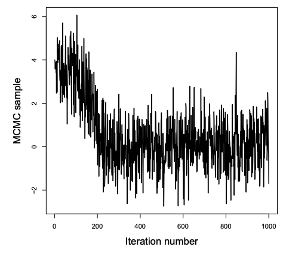
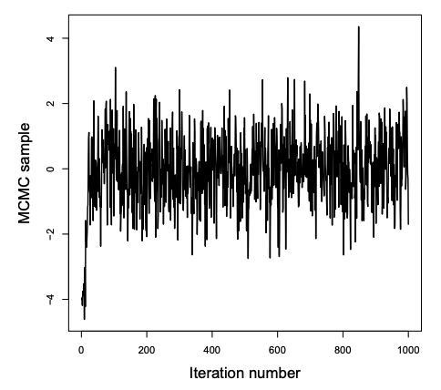
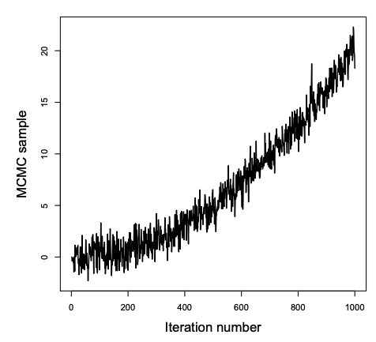
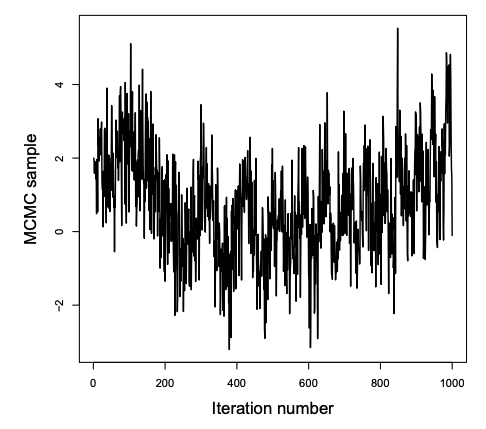

```{r setup, include=FALSE, cache=TRUE}
knitr::opts_chunk$set(echo = TRUE)
```

## Example: Change in GOP support

As a first example using the Gibbs sampler, we'll explore differences in voting patterns between the 2012 and 2016 presidential elections in 49 of the 50 states. (Sorry Alaska, you're data were a bit too messy!) Specifically, we will explore how the support for GOP presidential candidates changed between the 2012 and 2016. The data are taken from  https://github.com/tonmcg/County_Level_Election_Results_12-16 and have been combined with county-level census data from https://www.kaggle.com/benhamner/2016-us-election. The 


Variable | Description
----------|------------------------------
`fips`  | 5-digit code: 2-digit state code, by 3-digit county
`area_name`     | name of the county
`state_abbreviation` | state abbreviation
`total_2012` | total votes cast in 2012
`gop_2012`   | votes cast for GOP candidate in 2012
`total_2016` | total votes cast in 2016
`gop_2016`   | votes cast for GOP candidate in 2012
`...`        | ... and 62 other variables...


### Data import and wrangling

You can load the full data set using the below code and restrict attention only to the columns of interest using the `select()` command in the **dplyr** package.

```{r message=FALSE}
library(dplyr)
votes <- read.csv("data/County_Election_08_16.csv")
votes <- select(votes, fips, area_name, state_abbreviation, 
                total_2012, gop_2012, total_2016, gop_2016)
```

In this example, let's define the change in GOP support to be the **percent change**. Let $A_i$ denote the number of GOP votes cast in 2012 in county $i = 1, \ldots, n$ and $B_i$ denote the number of GOP votes cast in 2016 in county $i$. Then the percent change, $Y_i$ is given by

$$Y_i = 100(B_i/A_i - 1)$$

To add the percent change to our data set, we can use the `mutate()` command in the **dplyr** package to add columns for the percentage of GOP votes in 2012 and 2016 (`gop_pct_2012` and `gop_pct_2012`, respectively) and then calculate `pct_change`:

```{r message=FALSE}
library(dplyr)
votes <- mutate(
  votes, 
  gop_pct_2016 = gop_2016 / total_2016,
  gop_pct_2012 = gop_2012 / total_2012,
  pct_change   = 100 * (gop_pct_2016 / gop_pct_2012 - 1)
)
```


### The proposed model

In this example, we will use the following Normal model to analyze the percent change in GOP support:

$$
\begin{aligned}
Y_i | \mu, \sigma^2 &\overset{\rm iid}{\sim} \mathcal{N}(\mu, \sigma^2) & \\
\mu & \sim \mathcal{N}(\mu_0, \sigma^2_0) &\\
\sigma^2 & \sim {\rm InvGamma}(a, b) &\\
\mu &\perp \sigma^2
\end{aligned}
$$

Notice that we are assuming the $\mu$ and $\sigma^2$ are independent. Further, we'll use the uninformative (or weakly informative) prior specification given by

$$
\mu_0 = 0, \qquad
\sigma^2_0 = 1000, \qquad
a = 0.1, \qquad
b = 0.1
$$

Using this model specification, the posterior distribution is given by

$$
\begin{aligned}
\mu, \sigma^2 | {\bf Y} &\propto \pi(\mu) \pi(\sigma^2) \cdot \prod_{i=1}^n f(y_i | \mu, \sigma^2)\\
  &\propto \exp \left[ - \dfrac{(\mu - \mu_0)^2}{2 \sigma^2_0} \right] \cdot \left(\sigma^2 \right)^{-a-1} \exp\left[ - \dfrac{b}{\sigma^2} \right] \cdot \\
  &\quad  \prod_{i=1}^n \left(\sigma^2 \right)^{-1/2} \exp\left[ - \dfrac{(y_i - \mu)^2}{2 \sigma^2} \right]
\end{aligned}
$$


### The Gibbs sampler

While we already have the tools to sample from the above posterior distribution in our toolkit, they do not scale and/or generalize well. Today, we'll focus on implementing the Gibbs sampler, which is a general way to sample from a posterior distribution from the full conditional posterior distributions. The two-parameter algorithm is given below:

**Algorithm:**

1. Set initial values for parameter values, $\boldsymbol{\theta}^{(0)} = \left(\theta^{(0)}_1, \theta^{(0)}_2 \right)$

2. Draw $\theta_1^{(1)}$ from $p(\theta_1 | \theta_2, {\bf Y})$ 

3. Draw $\theta_2^{(1)}$ from $p(\theta_2 | \theta_1, {\bf Y})$ 

4. Repeat steps 2-3 $S$ times

After convergence, draws $\left( \theta_1^{(k)}, \theta_2^{(k)} \right)$ are from the posterior distribution


### Deriving the full conditionals

Before we can implement the Gibbs sampler, we must derive the full conditionals. (Yes, you can't avoid the algebra forever. It will simplify your Bayesian lives, so learn to like it!)

The full conditionals are derived below. Be sure to understand how to derive these on your own!

$$
\begin{aligned}
p(\sigma^2 | {\boldsymbol Y}, \mu) &= \dfrac{f({\boldsymbol Y} | \sigma^2, \mu) \pi(\sigma^2) \pi(\mu)}{f({\boldsymbol Y})}\\
&\propto f({\boldsymbol Y} | \sigma^2, \mu) \pi(\sigma^2)\\
&\propto \left[ \prod_{i=1}^n \left(\sigma^2 \right)^{-1/2} \exp\left( - \dfrac{(y_i - \mu)^2}{2 \sigma^2} \right) \right] \left[\left(\sigma^2 \right)^{-a-1} \exp\left( - \dfrac{b}{\sigma^2} \right) \right]\\
&= \left[ \left(\sigma^2 \right)^{-n/2} \exp\left(- \frac{{\rm SSE}}{2 \sigma^2} \right) \right]  \left[\left(\sigma^2 \right)^{-a-1} \exp\left( - \dfrac{b}{\sigma^2} \right) \right]\\
&= \left(\sigma^2 \right)^{-\left(\frac{n}{2} + a \right) - 1} \exp\left( - \frac{{\rm SSE/2 + b}}{ \sigma^2} \right) 
\end{aligned}
$$

<br>

So $\sigma^2 | {\boldsymbol Y}, \mu$ is...

<br>


$$
\begin{aligned}
p(\mu | {\boldsymbol Y}, \sigma^2) &= \dfrac{f({\boldsymbol Y} | \sigma^2, \mu) \pi(\sigma^2) \pi(\mu)}{f({\boldsymbol Y})}\\
&\propto f({\boldsymbol Y} | \sigma^2, \mu) \pi(\mu)\\
&\propto \exp\left[ - \dfrac{ \sum(y_i - \mu)^2}{2 \sigma^2} \right] \exp\left[ - \dfrac{(\mu - \mu_0)^2}{2 \sigma_0^2} \right]\\
&= \exp\left[ -\frac{1}{2} \left( \frac{\sum y_i^2}{\sigma^2} - 2 \frac{\sum y_i}{\sigma^2} \mu + \frac{n}{\sigma^2} \mu^2 + \frac{\mu^2}{\sigma^2_0} - 2\frac{\mu_0}{\sigma_0^2} \mu  + \frac{\mu^2_0}{\sigma^2_0} \right) \right]\\
&\propto \exp \left[  -\frac{1}{2} \left( -2 \left\{ \frac{n \bar{y}}{\sigma^2} + \frac{\mu_0}{\sigma^2_0}  \right\} \mu + \left\{  \frac{n}{\sigma^2_0}  + \frac{\mu_0}{\sigma^2_0} \right\} \mu^2 \right) \right]\\
&= \exp \left[ -\frac{1}{2} \left( -2A\mu + B \mu^2 \right) \right]\\
&= \exp \left[ -\frac{B}{2} \left( -2\frac{A}{B}\mu +  \mu^2 \right) \right]\\
&\propto \exp \left[ -\frac{B}{2} \left(\mu - \frac{A}{B} \right)^2 \right]\\
\end{aligned}
$$

<br>

So $\mu | {\boldsymbol Y}, \sigma^2$ is...

<br>

## Implementing the Gibbs sampler in R

The hardest part about implementing a small Gibbs sampler is the amount of bookkeeping involved. I recommend beginning with a standard set up where you initialize the parameter values and create an empty matrix (or data frame) to store the MCMC samples.

```{r}
# Data
y <- na.omit(votes$pct_change)
n <- length(y)

# Prior specification
mu0 <- 0
s20 <- 1000
a   <- 0.1
b   <- 0.1

# Initial parameter values
mu <- mean(y)
s2 <- var(y)


# Create empty S x p matrix for MCMC draws
S                    <- 10000
mcmc.draws           <- matrix(NA, nrow = S, ncol = 2)
colnames(mcmc.draws) <- c("mu", "sigma2")
```

Once you have loaded the data, initialized the parameters, and set up storage for the MCMC samples, the Gibbs sampler boils down to a for loop where you draw single samples for each parameter, conditioned on the last draw of the other parameter. Here, I sample draw $\mu^{(i)}$ before $\sigma^{2^{(i)}}$, but this order is not important. Be sure to understand each element of the `for` loop. Note that I am using the `rinvgamma()` command in the **MCMCpack** package to draw samples from the inverse gamma distribution.

```{r}
for(i in 1:S) {
  
  # sample from mu | s2, y
  A   <- sum(y) / s2 + mu0 / s20
  B   <- n / s2 + 1 / s20
  mu  <- rnorm(1, A/B, 1/sqrt(B))
  
  # sample from se | mu, y
  shape  <- n / 2 + a
  scale  <- (sum((y - mu)^2) / 2)  + b
  s2     <- MCMCpack::rinvgamma(1, shape, scale)
  
  # Store the draws
  mcmc.draws[i, ] <- c(mu, s2)
}
```


I don't expect you to be able to code extremely complex samplers, but understanding how to code small versions will help you understand how they work and when they fail more deeply than relying only on automated computational routines. Next week we'll explore how to avoid always writing our own MCMC code, so don't distress if for loops have you down!


### Checking convergence

To check whether our Markov chain reached the stationary distribution, we can create trace plots to check whether they look like white noise (or fuzzy caterpillars if you prefer).

```{r echo=FALSE, fig.height = 3.5, fig.width = 9, fig.align='center', out.width="0.9\\textwidth"}
par(mfrow = c(1,2))
plot(x = 1:S, y = mcmc.draws[,"mu"], xlab = "Iteration", ylab = "MCMC sample", type = "l", main = bquote("Traceplot: for " ~ mu))

plot(1:S, mcmc.draws[,"sigma2"], xlab = "Iteration", ylab = "MCMC sample", type = "l", main = bquote("Traceplot: for " ~ sigma^2))
```

**Your turn.** For each of the following trace plots, determine

1. whether the chain converged, and

2. roughly how many iterations it took to converge.

\begin{multicols}{2}

```{r echo=FALSE, out.width="0.5\\textwidth"}

```

```{r echo=FALSE, out.width="0.5\\textwidth"}

```

```{r echo=FALSE, out.width="0.5\\textwidth"}

```

```{r echo=FALSE, out.width="0.5\\textwidth"}

```
\end{multicols}


### Posterior analysis

If you are convinced that your Markov chain has converged to the stationary distribution, then you can toss out samples prior to convergence (this is called the *burn in* period) and draw inferences using the remaining MCMC samples just like we have all term.

```{r}
# Removing the first 100 samples
mcmc.draws <- mcmc.draws[-c(1:100),]
```